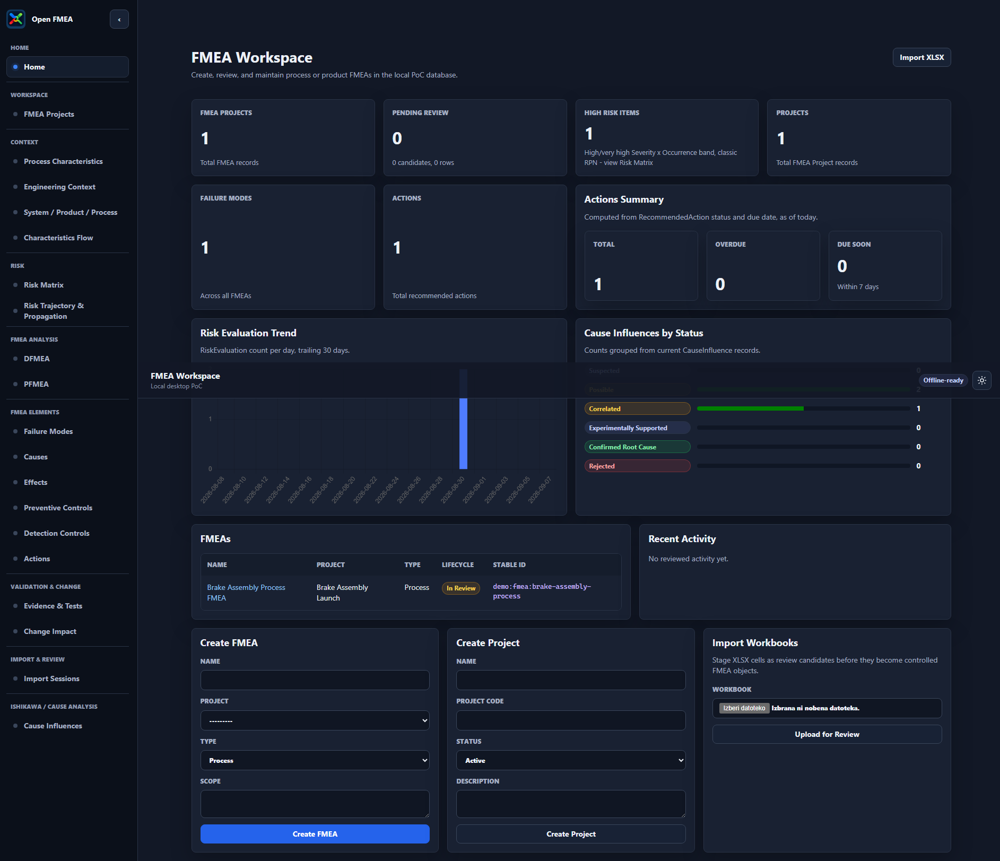

<p align="center">
  
</p>

# Open FMEA

Open FMEA is a local-first Django application for building, reviewing, and maintaining Failure Modes and Effects Analysis records. The current app combines a portable Python domain layer with Django persistence, workbook ingestion, review queues, risk evaluation, Ishikawa cause analysis, and focused FMEA workflow screens.

## Preview

<p align="center">
  
</p>

## Development Context

This public Django app release was prepared through a Claude + Codex workflow. Claude was used for architecture review and implementation guidance, Codex for repository work and verification, and Ollama is supported as the optional local AI provider for structured extraction experiments.

## Repository Layout

```text
django_app/                   Django project and application packages
domain/fmea_domain/           Framework-free Open-FMEA domain model and rules
docs/exchange-format/         Open-FMEA Exchange Format documentation and schema
samples/open_fmea/            Workbook fixtures used by ingestion tests
tests/                        Domain and portability tests
```

## Development Setup

```powershell
python -m venv .venv
.\.venv\Scripts\Activate.ps1
python -m pip install --upgrade pip
pip install -r requirements.txt
```

## Run the App

```powershell
python manage.py migrate
python manage.py seed_demo
python manage.py runserver
```

Open `http://127.0.0.1:8000/`.

## Run Checks

```powershell
python -B manage.py check
python -B manage.py makemigrations --check --dry-run
python -B -m pytest
```

## Current App Surface

- FMEA workspace dashboard
- FMEA projects and team roster
- DFMEA/PFMEA worksheet views
- Product and process characteristics
- Functions, failure modes, effects, causes, controls, and actions
- Risk matrix and risk trajectory views
- Ishikawa cause influence review
- Workbook import and row-level review

## Community and Security

- See `CONTRIBUTING.md` for contribution guidelines.
- See `CODE_OF_CONDUCT.md` for project conduct expectations.
- See `SECURITY.md` for vulnerability reporting.

## Packaging Notes

The GitHub Release provides a Windows desktop demo package. The cross-platform package is published as a container image through GitHub Container Registry:

```powershell
docker pull ghcr.io/dromation/open-fmea:latest
docker run --rm -p 8000:8000 -v open-fmea-data:/data ghcr.io/dromation/open-fmea:latest
```

Open `http://127.0.0.1:8000/`. The container stores the local SQLite demo database in the `open-fmea-data` volume.

The historical prototype and architecture working notes are intentionally not part of the public app release branch.

## License

This project is licensed under the GPL 3.0 License. See `LICENSE` for details.
